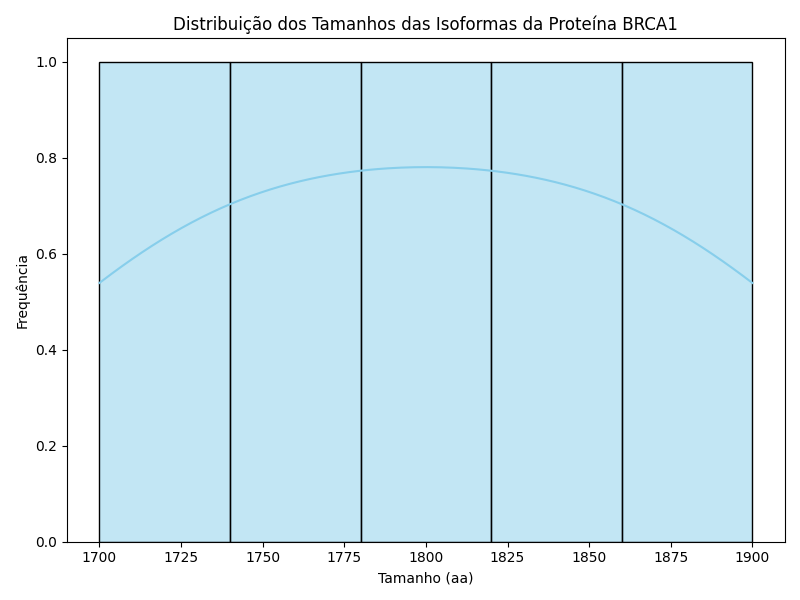
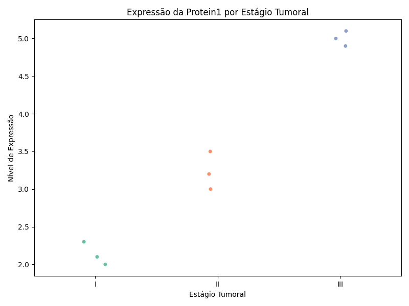
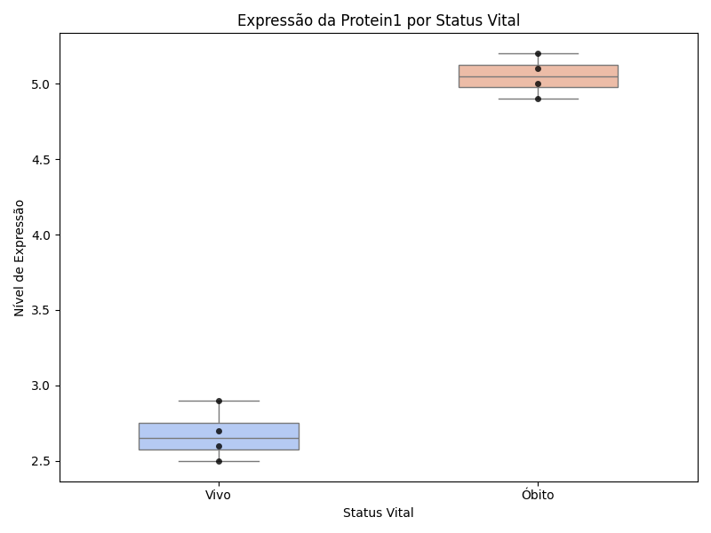
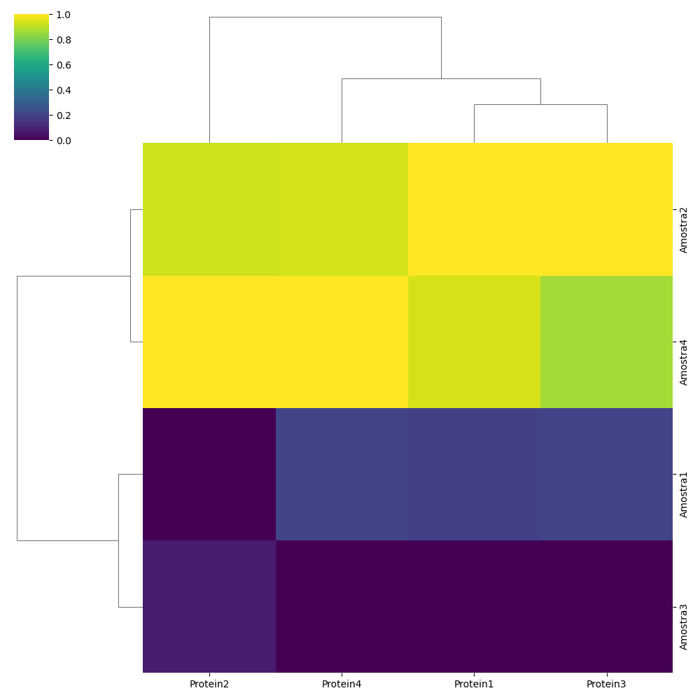
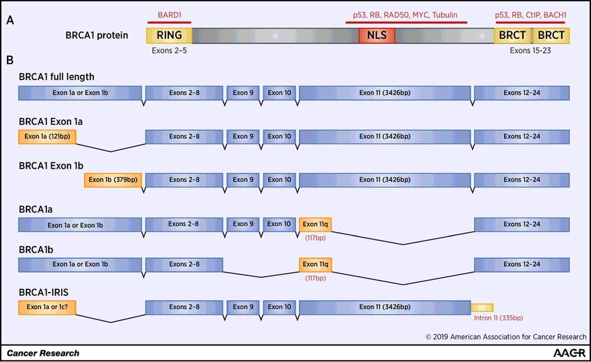

# 🧬 Análise Integrativa da Expressão de BRCA1 em Câncer de Mama

Este repositório contém análises bioinformáticas realizadas com dados clínicos e genéticos do gene **BRCA1**, com foco em sua expressão, estrutura funcional e impacto potencial de mutações no contexto do câncer de mama.

## 👩‍💻 Autora

**Valkiria Franzoni dos Anjos da Costa**  
📧 Email: valkiriafranzoni@gmail.com  
🔗 LinkedIn: [linkedin.com/in/valkiria-franzoni](https://www.linkedin.com/in/valkiria-franzoni)

## 📌 Objetivo

Explorar a relação entre dados clínicos de pacientes com câncer de mama e dados genéticos do gene **BRCA1**, incluindo:

- Expressão da proteína BRCA1 por estágio tumoral e status vital;
- Estrutura funcional e domínios da proteína BRCA1;
- Análise de isoformas da proteína geradas por splicing alternativo;
- Identificação de padrões de expressão por clusterização hierárquica.

## 🧪 Metodologia

Foram utilizados dados clínicos de 317 pacientes com câncer de mama, incluindo idade, sexo, estadiamento, histologia e expressão de proteínas (Protein1 a Protein4). Após normalização, Protein1 foi identificada como a mais expressa e relacionada ao gene BRCA1. Sequências genéticas (DNA, RNA e proteína) do BRCA1 foram extraídas do NCBI para análises de isoformas, domínios e mutações simuladas.

## 📊 Resultados

- Predominância feminina: 98,7% dos casos.  
- Média de idade: 58,7 anos.  
- Estágio tumoral mais frequente: II.  
- Protein1 (BRCA1) teve a maior expressão relativa após normalização.  
- Expressão variou por estágio tumoral e status vital.  
- Foram identificados três domínios funcionais principais na proteína BRCA1: RING, NLS e BRCT.  
- As duas maiores isoformas da proteína apresentaram 100% de identidade.  
- Mutações simuladas foram aplicadas nos domínios funcionais e podem afetar sua função.

## 📈 Visualizações

### Gráfico 1 – Boxplot dos comprimentos de DNA, RNA e proteína do gene BRCA1 (Python/Seaborn)
Mostra os tamanhos das sequências do gene BRCA1, destacando a diferença entre DNA (~125.000 pb), RNA (~10.000 pb) e proteína (~1.900 aa).

### Gráfico 2 – Histograma com KDE dos tamanhos das isoformas da proteína BRCA1 (Python/Matplotlib)
Ilustra a distribuição do comprimento das isoformas de BRCA1, evidenciando a predominância de duas isoformas principais.

### Gráfico 3 – Stripplot da expressão da Protein1 por estágio tumoral (Python/Seaborn)
Apresenta variação da expressão da BRCA1 por estágio do câncer, com tendência decrescente em estágios mais avançados.

### Gráfico 4 – Stripplot da expressão da Protein1 por status vital (Python/Seaborn)
Compara a expressão da BRCA1 entre pacientes vivos e falecidos, sugerindo relação com prognóstico.

### Gráfico 5 – Mapa funcional dos domínios da proteína BRCA1 (RING, NLS, BRCT)
Imagem ilustrativa destacando os domínios estruturais da BRCA1 e regiões-alvo de mutações simuladas.

### Gráfico 6 – Heatmap com clusterização hierárquica da expressão das proteínas Protein1–Protein4 (Python/Seaborn Clustermap)
Agrupa pacientes com base em padrões de expressão, sugerindo subgrupos biológicos distintos.

## 💬 Discussão

A expressão elevada da BRCA1 e sua conservação estrutural reforçam seu papel como marcador funcional em câncer de mama. As mutações simuladas sugerem impacto potencial na regulação genômica e sinalização celular, apoiando investigações futuras em medicina personalizada.


## 🗂️ Estrutura do Projeto

```
brca1_breast_cancer/
├── 01_boxplot_tamanhos_brca1.py
├── 02_histograma_isoformas_brca1.py
├── 03_stripplot_estagio_tumoral.py
├── 04_stripplot_status_vital.py
├── 05_mapa_funcional_brca1.py
├── 06_clustermap_proteinas.py
├── data/
├── images/
   - 05_mapa_funcional_brca1.png   ← mapa funcional manual
├── README.md
└── requirements.txt
```
## 🏁 Conclusão

A integração entre dados clínicos e moleculares permite uma análise mais completa do comportamento tumoral. Este modelo pode ser expandido para outros genes e doenças com impacto significativo em terapias direcionadas.

## 📊 Resultados da Análise

### Histograma das Isoformas


### Stripplot Estágio Tumoral


### Box Swarm Status Vital


### Clustermap de Proteínas


### Mapa Funcional



## 🚀 Como Executar Localmente

```bash
python -m venv venv
source venv/bin/activate  # ou venv\Scripts\activate no Windows
pip install -r requirements.txt
```

## 📚 Referências

- RefSeq (2020). BRCA1 gene. NCBI.
- Miki Y et al. (1994). Science.
- The Cancer Genome Atlas (TCGA).
- NCBI GEO Database.
